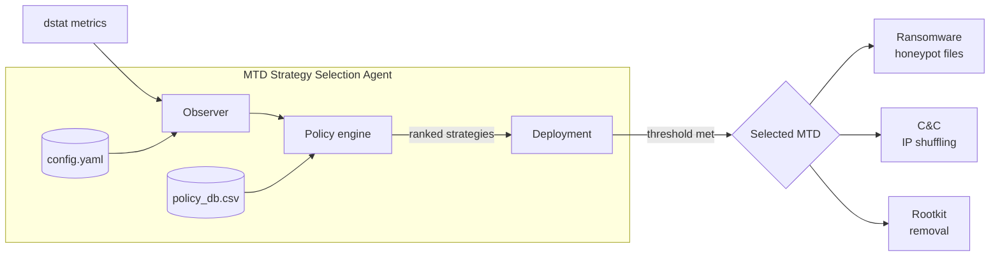

<div align="center">

# MTD Strategy Selection Agent

**A lightweight agent that watches a device's system metrics, detects malware behaviour, and automatically deploys the most fitting Moving Target Defense (MTD) countermeasure.**


[Quick start](#quick-start) · [How it works](#how-it-works) · [Architecture](#architecture) · [Documentation](#documentation)

</div>

The **MTD Strategy Selection Agent** (StraSelA) was built for a Bachelor thesis at the University of Zurich in 2022. It continuously samples operating-system metrics with [`dstat`](https://linux.die.net/man/1/dstat), matches the observed behaviour against a policy database, and — when a threshold is exceeded — selects and deploys the Moving Target Defense strategy that best counters the suspected attack (ransomware, command-and-control, or rootkit).

The agent and its evaluation were developed and measured on a Raspberry Pi–based [ElectroSense](https://electrosense.org/) sensor.

## Features

- 📊 **Behaviour-based detection** — averages CPU, memory, disk, network and process metrics over a sliding history window.
- 📜 **Policy-driven** — human-readable CSV rules map metric thresholds to defense strategies; no model retraining needed.
- 🛡️ **Automatic countermeasures** — deploys ransomware honeypots, IP shuffling, or rootkit removal on detection.
- 🔬 **Reproducible evaluation** — Jupyter notebooks and the raw measurement data behind the thesis results are included.

> [!NOTE]
> This repository contains only the **defensive** agent, its countermeasures, the measurement tooling, and the collected data. The malware used to evaluate it is **not** included; the attack scripts under [`attacker/`](attacker/) merely orchestrate external samples that lived in an isolated lab testbed.

> [!WARNING]
> This is archived academic work from 2022. The dependencies are pinned to that time, several runtime paths are hard-coded for the original testbed (see [Known issues](#known-issues)), and the project is not maintained. It is published for reference and reproducibility, not for production use.

## Contents

- [How it works](#how-it-works)
- [Tech stack](#tech-stack)
- [Architecture](#architecture)
- [Repository structure](#repository-structure)
- [Quick start](#quick-start)
- [Configuration](#configuration)
- [Defense strategies](#defense-strategies)
- [Data](#data)
- [Development](#development)
- [Documentation](#documentation)
- [Known issues](#known-issues)
- [Acknowledgements](#acknowledgements)
- [License](#license)
- [Author](#author)

## How it works

Every cycle the agent runs three components:

1. **Observer** — runs `dstat`, extracts the last _N_ timestamped samples, strips unit suffixes (`k`, `M`, `B`), and averages each metric over the window.
2. **Policy** — for every metric, compares the averaged value against each rule in [`agent/policy_db.csv`](agent/policy_db.csv). A rule that fires is a "hit" for the strategy it points to; the agent tracks positive and negative hits per strategy and ranks them.
3. **Deployment** — if the best strategy's hit ratio meets `detectionThreshold`, the agent runs that strategy's command, logs the decision, and pauses before the next cycle.

A policy rule is a single line — `metric,sign,threshold,strategy`, e.g. `writ,>=,200000,MTD1` ("if the write rate is at least 200000, that is evidence for MTD1"). Decisions are written to `observer.log` and `deployer.log`.

## Tech stack

| Area | Technologies |
|---|---|
| Language |  |
| Data & analysis |     |
| System / runtime |    |
| Tooling |   |
| Target device |  |

## Architecture



| Component | Location | Responsibility |
|---|---|---|
| Agent | [`agent/mtd_strategy_selection_agent.py`](agent/mtd_strategy_selection_agent.py) | Observer + policy + deployment loop |
| Policy database | [`agent/policy_db.csv`](agent/policy_db.csv) | Metric-threshold rules per strategy |
| Configuration | [`agent/config.yaml`](agent/config.yaml) | dstat command, thresholds, MTD commands |
| MTD strategies | [`agent/MTD/`](agent/MTD/) | The deployable countermeasures |
| Monitoring | [`monitoring-script/`](monitoring-script/) | Standalone `dstat` data collection |
| Attack orchestration | [`attacker/`](attacker/) | Drivers that launched the external evaluation malware |
| Analysis | [`visualizations/`](visualizations/) | Notebooks, measurement data and plots |

## Repository structure

| Path | Description |
|---|---|
| [`agent/`](agent/) | The agent, its configuration, policy database and MTD countermeasures |
| [`agent/MTD/`](agent/MTD/) | Ransomware, C&C and Rootkit defense scripts |
| [`attacker/`](attacker/) | Scripts that orchestrated the external malware during evaluation |
| [`monitoring-script/`](monitoring-script/) | `dstat`-based system-metric collector |
| [`utils/`](utils/) | Helper scripts (cleanup, ransomware-damage plots) |
| [`visualizations/`](visualizations/) | Jupyter notebooks and the raw evaluation data |
| [`docs/`](docs/) | Extended documentation |

## Quick start

### Prerequisites

- Python 3.8+ and [uv](https://docs.astral.sh/uv/)
- Linux with `dstat` installed (the agent shells out to it):

```bash
sudo apt-get install dstat
```

> [!NOTE]
> The agent and its countermeasures target a Linux host (originally a Raspberry Pi sensor) and use hard-coded paths and root privileges. Run it in a disposable VM or container, not on your workstation. See [Known issues](#known-issues).

### Install dependencies

```bash
uv sync
```

To also install the plotting dependency used by the notebooks:

```bash
uv sync --extra viz
```

### Run the agent

```bash
cd agent
```

```bash
uv run python mtd_strategy_selection_agent.py
```

The agent reads `config.yaml` and `policy_db.csv` from the working directory and appends its decisions to `observer.log` and `deployer.log`.

### Collect metrics only

To gather `dstat` measurements without running the agent:

```bash
bash monitoring-script/monitoring-script.sh
```

## Configuration

Configured through [`agent/config.yaml`](agent/config.yaml):

| Key | Meaning | Default |
|---|---|---|
| `historyLen` | Number of recent `dstat` samples averaged per cycle | `10` |
| `detectionThreshold` | Minimum hit ratio required to deploy a strategy | `0.6` |
| `evaluationMethod` | Ranking method — `0`: absolute hits, `2`: hit percentage | `2` |
| `dstatCommand` | The `dstat` invocation used by the observer | see file |
| `ransomwareMTD` / `cncMTD` / `rootkitMTD` | Command run when the matching strategy is selected | see file |

## Defense strategies

| ID | Threat | Countermeasure | Script |
|---|---|---|---|
| MTD1 | Ransomware | Continuously creates honeypot dummy files to slow encryption and detect the culprit process | [`CreateDummyFiles.py`](agent/MTD/Ransomware/CreateDummyFiles.py), [`ChangeFileTypes.py`](agent/MTD/Ransomware/ChangeFileTypes.py), [`KillProcess.py`](agent/MTD/Ransomware/KillProcess.py) |
| MTD2 / MTD4 | Command & control | Shuffles the device's IP address and re-establishes connectivity | [`ChangeIpAddress.py`](agent/MTD/CnC/ChangeIpAddress.py) |
| MTD3 | Rootkit | Restores the known-good `ld.so.preload` to un-hook an `LD_PRELOAD` rootkit | [`RemoveRootkit.py`](agent/MTD/Rootkit/RemoveRootkit.py) |

## Data

The [`visualizations/`](visualizations/) folder contains the raw measurement data behind the thesis results, grouped by experiment (policy synthesis, individual, mixed and overhead evaluation). Each scenario folder holds the `dstat` CSV log, a `netstat` log, and the observer/deployer logs from that run.

All data was **self-collected** on the author's own isolated testbed; it contains no third-party datasets and no personal data.

## Development

| Task | Command |
|---|---|
| Install dependencies | `uv sync` |
| Lint | `uvx ruff check .` |
| Format | `uvx ruff format .` |
| Run the agent | `cd agent && uv run python mtd_strategy_selection_agent.py` |

Dependency versions are pinned in [`uv.lock`](uv.lock) to the state at thesis submission (via `exclude-newer` in [`pyproject.toml`](pyproject.toml)), so the project resolves as it did in 2022.

## Documentation

| Guide | Description |
|---|---|
| [Architecture](docs/architecture.md) | The observer → policy → deployment pipeline in detail |
| [Policy database](docs/policy.md) | Rule format and how the synthesised policy was derived |
| [Evaluation](docs/evaluation.md) | The experiments and how to reproduce the plots |

## Known issues

- **Hard-coded paths.** The agent and MTD scripts reference absolute paths such as `/root/MTDStrategySelectionAgent/…` and `/root/sample-data`, and the attack drivers reference `/root/Malware/…`. These reflect the original testbed and must be adjusted for any other environment.
- **Root privileges and device specifics.** The C&C strategy restarts an ElectroSense sensor service, and the rootkit strategy targets a specific ARM `ld-2.24.so`; both assume the original Raspberry Pi sensor and root access.
- **External malware not included.** The evaluation samples are not part of this repository, so the attack orchestration in [`attacker/`](attacker/) cannot be run as-is.

## Acknowledgements

This work builds on parts of the [MTD Framework](https://github.com/CortexVacua/MTDFramework) by **Jordan Cedeño** — many thanks. That framework carries its own license; the MIT license of this repository does not extend to it.

Supervised by **Jan von der Assen** and **Dr. Alberto Huertas Celdrán**, under **Prof. Dr. Burkhard Stiller**, Communication Systems Group (CSG), Department of Informatics, University of Zurich.

## License

Released under the [MIT License](LICENSE). Third-party components (the MTD Framework, and the external malware referenced by the evaluation scripts) retain their own licenses.

## Author

**Nicolas Huber** — Bachelor thesis, University of Zurich, 2022.
